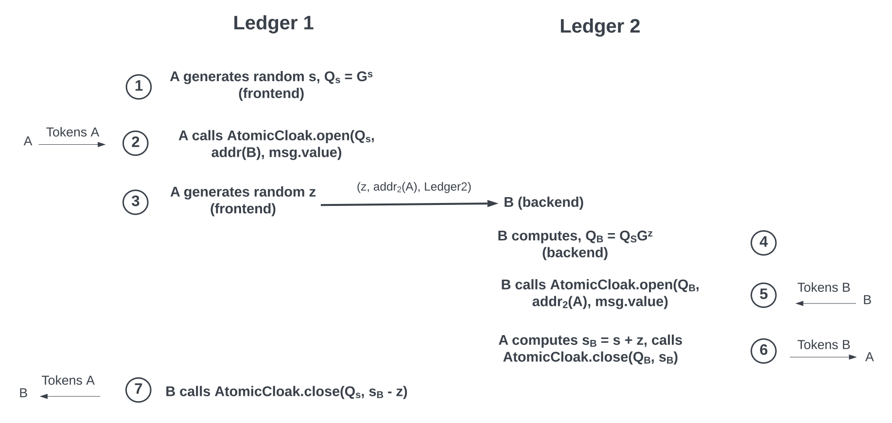
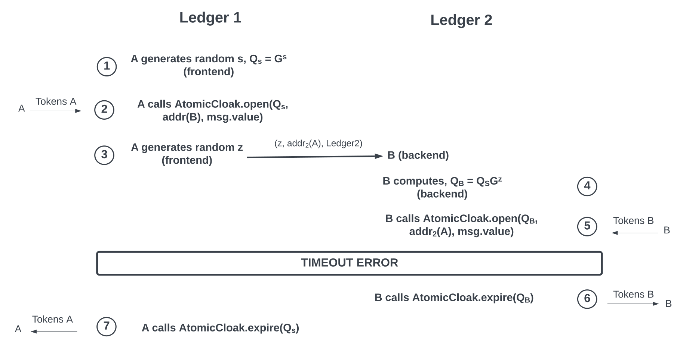

  

# Specificaitons

## Atomic Cloak

_Mixer-style privacy preserving cross-chain atomic swaps. Withdraw ETH and ERC-20 from L2 anonymously and instantly via a liquidity provider._

## Rationale

### TL;DR:

Problem:

1. Slow or centralized withdrawals from optimistic L2;
2. Everlasting desire for token anonymization tools.

Solution: Atomic swaps using Schnorr-locked time contracts.

### Problem

ETH and ERC-20 token transfers between L2s and L1 have several limitations. For optimistic rollups, a user must choose among two evils: either to wait for long withdrawal period or rely on a centralized cross-chain service.

ZK rollups offer a much better deal in theory: tokens could be withdrawn as fast as a ZK proof is generated and verified and the technology can be used to provide a native privacy protection. However, in practice current ZK-rollups are still not instant (e.g. zkSync waits for 1 day to be on the safe side), and they face pressure from governments to avoid any anonymization functionality.

### Solution

Atomic swaps based on Hash Timelocked Contracts are a well-know beast in the crypto community. The cryptography of HTLC allows two peers to atomically exchange assets (either each gets what they want or nobody gets anything), and no trust is needed. (see Section 3.1 [here](https://eprint.iacr.org/2019/896.pdf)) The cryptographical core of the algorithm can facilitate asset exchange across different chains.

Our solution extends the idea of HTLC to Schnorr Timelocked Contracts, based on [this paper](https://fc20.ifca.ai/wtsc/WTSC2020/WTSC20_paper_20.pdf). Main idea: the hash function is chosen so the opening commitments on two different contracts can not be linked by a third party. Ether and ERC-20 can be swapped using the contract.

The privacy-protection of Atomic Cloak is based on a mixer + account abstraction. From the outside, STLC counterparties cannot be identified and all requests created at the same time cannot be distinguished from other requests of the same value tier. Also it is impossible to determine the destination chain of tokens, so several cross-chain swaps with random wait times can obfuscate token sender very well.

### Liquidity Provision

The Atomic Cloak protocol is agnostic to how the swap counterparties agree on the swap, this logic happens off-chain in the UI.

For simplicity, our web interface implements a swap liquidity provider: an entity that hold liquidity on different chains and always accepts swap requests. It is possible to design different ways to find a swap party, but it necessarily must include a secure communication channel for cryptography reasons. In our solution, such channel is communication between UI frontend and backend.

### Cryptography

The privacy and atomicity of Atomic Cloak relies on the [discrete log problem](https://en.wikipedia.org/wiki/Discrete_logarithm), the same cryptography that protects Ethereum secret keys. The protocol is similar to Schnorr signature with an empty message hash.

0. Alice and Bob agree for a swap.
1. Alice chooses a secret key $s_A \in Z_q$ and computes $Q_A = G^{s_A}$, where $G$ is the generator of `secp256k1` elliptic curve group. Note that $s_A$ can not be recoveref from $Q_A$.
2. Alice creates an atomic swap with Bob by locking tokens in a contract. Tokens can be withdrawn:
    - either by Bob after presenting $s_A$, or
    - after timeout period by Alice.
3. Alice generates random $z\in Z_q$ and sends it together with her preferred receiving address to Bob.
4. Bob computes $Q_B = Q_A G^z$ and creates an atomic swap with Alice's receiving address. The timeout must be shorter than on Alice's contract.
5. At this point Alice can compute $Q_B$ and withdraw from Bob's contract by presenting $s_B = s_A + z$, since $G^{s_B} = Q_B$. In doing so, she reveals $s_B$.
6. Bob can now compute $s_A = s_B - z$ and withdraw from Alice's contract.

### Atomic Cloak swap flows
__Execution flow of a successful Atomic Cloak swap:__

__Execution flow of a timed out Atomic Cloak swap:__

## Challenges

We faced several challenges :

1. Efficiently implementing cryptography for Schnorr Timelocked Contracts.
2. Indexing all relevant on-chain events (opening and closing) to provide a comfortable UI.
3. Closing an anonymized swap could still be tracked to the gas payer and thus to the closer.
4. Gas-efficiently opening many STLCs for liquidity providers.
5. Deploying AtomicCloak contract to different chains with the same address.

__Solution to 1__: Abuse `ecrecover` opcode to multiply an EC point with a scalar as explained [here](https://ethresear.ch/t/you-can-kinda-abuse-ecrecover-to-do-ecmul-in-secp256k1-today/2384/4).

__Solution to 2__: use The Graph to listen to emitted events.

**Solution to 3**: account abstraction. Using [EIP-4337][https://eips.ethereum.org/EIPS/eip-4337] protocol, the SLT contract itself can pay swap closure fee for a small fraction of the swap amount. To close a swap, a user creates a UserOperation with the reveal data, and can withdraw tokens to a fresh empty account. Note that a user can also close with a transaction (e.g. to use on chains with no AA features), but this will provide risks for privacy.

__Solution to 4__: account abstraction. We use transaction batching feature of EIP-4337 to open many atomic swaps with a single transaction.

__Solution to 5__: deploy everything via factories that use `CREATE2` opcode.

## Future ideas

At ETHPrague, Atomic Cloak is just a minimal proof of concept. However we believe in the value of the project and suggest the following improvements to make it production-ready.

1. **Decentralize.** Create a UI to find atomic swap peers and exchange secret information in an encrypted channel. Allow liquidity provider registration to support instant swaps.
2. **Exchange.** Allow opening contracts hold different tokens (e.g. different ERC-20, or ether and ERC-20), as agreed off-chain by peers. This would further boost privacy and allow token exchange functionality.
3. **Add Noise Creators.** To boost privacy, create a service to create noise swaps. Noise creators will open and close swaps among different chains, so other swaps could be obfuscated among the noise.
4. **Do general reveal of secret.** The protocol could be generalized beyond atomic token swaps by replacing the swap closing logic. In this way other atomic revals of secret could be implemented.

# Development

## Deployments

The instance of Atomic Cloak smart contract is deployed on following networks (to be updated):

| Networks       |            Address      |
|----------------|-------------------------|
| sepolia        |  `0x...`                |
